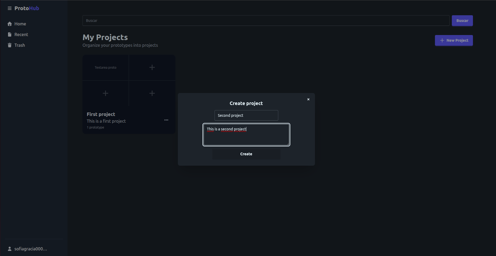
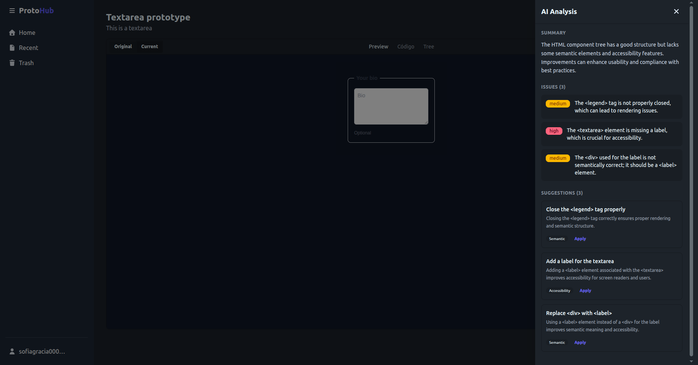
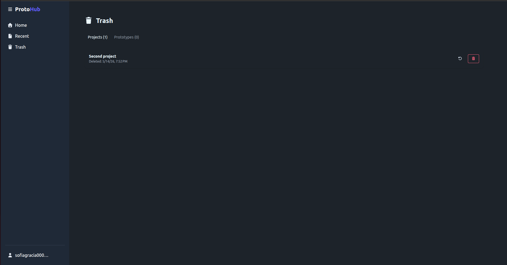
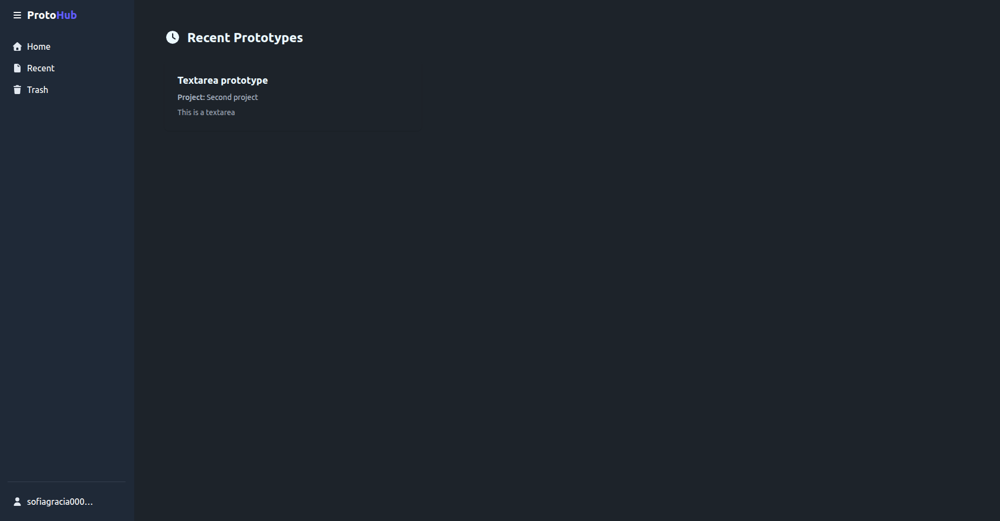

# ProtoHub

A frontend prototyping workspace built with **Angular 21** and **Supabase**. Create projects, upload HTML prototypes, preview them in the browser, and keep your work organized — with authentication, pagination, caching, and a trash restore flow.

---

## Screenshots

> Add screenshots or demo GIFs to `public/assets/images/screenshots/`.

<!--


-->

---

## Features

- **Supabase authentication** — signup, login, logout with Row Level Security
- **Project CRUD** — create, rename, and delete projects
- **Prototype CRUD** — upload HTML files, store them as prototypes, edit and delete
- **HTML preview** — render prototypes in a sandbox iframe with preview/code tabs
- **Trash restore flow** — deleted items go to trash; restore or permanently delete
- **Offset/limit pagination** — navigate through projects and prototypes
- **In-memory caching** — paginated data cached in facades; invalidated on mutation
- **Responsive UI** — DaisyUI components adapt across screen sizes
- **E2E testing** — Playwright tests covering critical user flows
- **Prototype Analysis (Experimental)** — send HTML structure to a Supabase Edge Function for automated UI feedback

### Create Project

[](https://github.com/SofiaGracia/ProtoHub/main/assets/videos/create-project.mp4)

### Create Prototype and AI Analysis

[](https://raw.githubusercontent.com/USERNAME/REPO/main/assets/videos/02_create_prototype_ai_analysis.mp4)

### Restore from trash

[](https://raw.githubusercontent.com/USERNAME/REPO/main/assets/videos/03_restore_from_trash.mp4)

### Recent

[](https://raw.githubusercontent.com/USERNAME/REPO/main/assets/videos/04_recent.mp4)

---

## Prototype Analysis (Experimental)

An experimental feature inside the prototype view that sends the rendered HTML structure to a Supabase Edge Function for automated analysis.

When the user clicks "Analyze UI", the frontend serializes the HTML tree into a structured text representation and POSTs it to the `analyze-ui` Edge Function. The backend processes the data and returns a list of issues and suggestions that can be applied directly to the prototype.

**Why it exists** — to explore how automated AI feedback can fit into an iterative prototyping workflow. It is a technical experiment, not a core feature.

---

## Tech Stack

| Technology | Role |
|-----------|------|
| Angular 21 | Frontend framework (standalone components) |
| Supabase | Backend-as-a-service (PostgreSQL + Auth) |
| RxJS 7 | Reactive data streams |
| Angular Signals | Local state management |
| Tailwind CSS v4 | Utility-first styling |
| DaisyUI v5 | UI component library |
| Playwright | E2E browser testing |
| Vitest | Unit testing (via Angular CLI) |

---

## Architecture

The project follows a **feature-based** structure with **standalone components** and a **Facade pattern** for state management:

```
src/app/
├── auth/              # Authentication (login, register)
├── projects/          # Project CRUD + list
├── prototypes/        # Prototype CRUD + preview
├── web-front/         # Landing and layout pages
└── shared/            # Common services and components
```

**Standalone components** — no NgModules. Each component declares its own dependencies via the `imports` array.

**Facade pattern** — services handle Supabase API calls; facades manage reactive state and expose observables/signals to components. Components remain thin and only concern themselves with rendering.

**Reactive state** — RxJS `BehaviorSubject` streams for async data (API responses), Angular Signals for synchronous UI state. The trade-off between the two is evaluated per feature.

**Separation of concerns** — UI components never call Supabase directly. Business logic lives in services and facades. Components receive data through observables and emit events upward.

---

## Testing

E2E tests are written with **Playwright** and validate complete user flows from login to data mutation.

### Approach

- **Deterministic selectors** — all interactive elements use `data-testid` attributes (mapped in `DATA_TESTID.md`)
- **Reusable auth** — `storageState` saves authenticated session after login, reused across test suites via `auth.json`
- **Helper modules** — `project.helper.ts` and `prototype.helper.ts` encapsulate repetitive UI interactions

### Flows tested

- Authentication (login with credentials stored in environment)
- Create a project
- Create a prototype (HTML file upload)
- Preview prototype rendering in sandbox iframe
- Trash → restore flow (delete and restore a project)

### Running tests

```bash
# Unit tests
ng test

# E2E tests (requires .env with E2E_EMAIL and E2E_PASSWORD)
npx playwright test
```

---

## Lessons Learned

This project went through several iterations, and the codebase reflects real trade-offs made along the way:

- **Refactoring after the fact** — early components mixed API calls, state, and rendering. Migrating to a Facade pattern required untangling dependencies that had grown organically.
- **Architecture consistency** — not every component was initially built with the same pattern. Bringing uniformity across features took deliberate effort and code review.
- **Memory leaks** — early versions leaked RxJS subscriptions. Moving to `takeUntilDestroyed` and Signals in appropriate places reduced the risk.
- **E2E reliability** — tests that relied on text selectors or timing were flaky. Switching to `data-testid` attributes and stable auth state made the suite deterministic.
- **RxJS vs Signals** — finding the right balance took time. Signals work well for synchronous UI state; RxJS remains the right tool for API streams and cross-component communication.
- **Structuring a frontend project** — there is no single "correct" folder layout. The current structure evolved from a flat fileset to a feature-based hierarchy after running into naming collisions and circular imports.

---

## Setup

```bash
# 1. Install dependencies
npm install

# 2. Configure Supabase credentials
# Create src/environments/environment.development.ts:
#
# export const environment = {
#   supabaseUrl: 'your-project-url',
#   supabaseKey: 'your-anon-key',
# };

# 3. Start the development server
ng serve

# 4. Run tests
ng test                           # unit tests (Vitest)
npx playwright test               # E2E tests (requires .env config)
```

---

## Future Improvements

- **Accessibility** — audit contrast ratios, keyboard navigation, and screen reader support
- **Test coverage** — add unit tests for services and facades (business logic); expand E2E coverage for edge cases
- **Prototype editor** — explore integrating a code editor (Monaco, CodeMirror) for in-browser HTML editing
- **State consistency** — reduce friction between RxJS streams and Signals, moving toward a unified approach where practical
